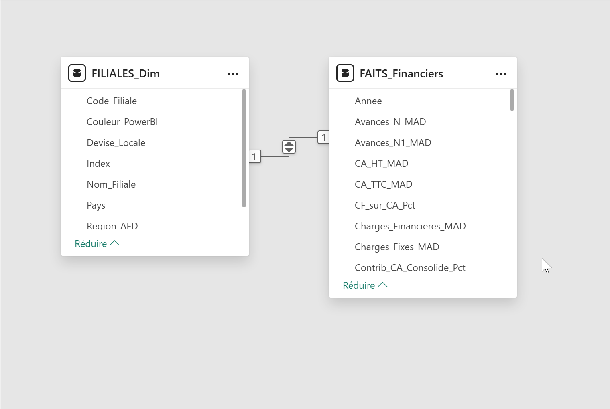

# Multi-Subsidiary Board Report — Strategic Arbitrage & Africa BU Performance | Power BI

> **Real client · CPA firm · Multi-subsidiary Africa portfolio · Delivered in production**  
> 3 pages · Star Schema · Heatmap · Scatter · Radar · Break-even analysis

🇫🇷 [Version française disponible ici](README_FR.md)

---

## Client Context

**Industry:** Certified Public Accountant (CPA) firm  
**Scope:** Multiple subsidiaries operating across Africa — consolidated BU  
**Stakeholder:** CPA — board meeting presentation  
**Timeline:** March – April 2026  
**Status:** Delivered and actively used in board meetings

> *Client data and dashboard visuals are not publicly shared to protect
> confidentiality. This repository documents the architecture, data modeling,
> and business logic.*

---

## Business Problem

The CPA was consolidating financial data from multiple African subsidiaries
in a multi-tab Excel file: unreadable in board meetings, no cross-subsidiary
comparison possible, and no decision support for 2026 strategic arbitrage.

**The board needed clear answers to 4 strategic questions:**

| # | Question |
|---|---|
| 1 | **Where are we actually making money?** |
| 2 | **Where are we losing cash?** |
| 3 | **Which entity is consuming the most debt?** |
| 4 | **Where should we cut or invest in 2026?** |

**Mission:** Transform a multi-subsidiary consolidated Excel file into an
interactive strategic arbitrage tool, operational from the first meeting.

---

## Solution Delivered

### Data Model Restructuring

Transformed the consolidated Excel file into a Power BI Star Schema:

```
Fact table
└── FAITS_Financiers     → financial indicators by subsidiary and period

Dimension table
└── FILIALES_Dim         → subsidiary characteristics and segmentation
```



Architecture optimized for dynamic filtering by subsidiary, region, and period,
with N vs N-1 comparison across all indicators.

### KPIs Developed

| Indicator | Description |
|---|---|
| `Revenue` | Revenue by subsidiary and consolidated |
| `EBITDA` | Earnings before interest, taxes, depreciation |
| `Net Income` | Final result after all charges |
| `Net Margin` | Net Income / Revenue — cross-subsidiary comparison |
| `Collection Rate` | Recovered receivables / Revenue — liquidity tracking |
| `Receivables Exposure` | Client outstanding N vs N-1 |
| `Break-even Point` | Minimum revenue to cover fixed costs |
| `Fixed Cost Absorption` | % of revenue consumed by fixed charges |

---

## Dashboard — 3 Pages

### Page 1 — Consolidated View
Global KPIs · P&L waterfall (Revenue → Net Income) · Consolidated collection rate · Receivables exposure N vs N-1

### Page 2 — Performance & Cash by Subsidiary
- **Multi-indicator heatmap** — instant performance reading across all subsidiaries
- **Revenue vs Net Margin scatter plot** — strategic positioning of each subsidiary
- **Cost analysis** — receivables exposure and fixed cost absorption by entity
- **Risk matrix** — subsidiaries ranked by operational risk level

### Page 3 — 2026 Arbitrage
- **Strategic radar** — multi-dimensional comparison across subsidiaries
- **Break-even vs actual revenue analysis** — identifies which entities are below threshold
- Direct answers to the board's 4 strategic questions

---

## Key Insights Extracted

| Insight | Detail |
|---|---|
| Concentrated profitability | Only 2 subsidiaries across the portfolio are genuinely profitable |
| Critical operational risk | One subsidiary absorbs **67% of its revenue in fixed costs** — urgent model review needed |
| Growth without cash | One subsidiary shows **+227% revenue growth** but a collection rate of only **62%** |

---

## Business Impact

| Result | Detail |
|---|---|
| Immediately operational | Used from the very first board meeting |
| Objectified arbitrage | 2026 decisions grounded in data, not intuition |
| Cross-subsidiary clarity | Direct comparison made possible for the first time |
| Full documentation | All calculation rules documented for reproducible use |

---

## Tech Stack

- **Power BI Desktop** — report development
- **DAX** — calculated measures, N vs N-1 comparisons, dynamic thresholds
- **Power Query / M** — restructuring of multi-tab consolidated Excel file
- **Excel** — consolidated data source
- **Star Schema** — dimensional modeling

### Advanced Visualizations
- P&L waterfall
- Multi-indicator heatmap by subsidiary
- Revenue vs Net Margin scatter plot
- Multi-axis strategic radar
- Dynamic risk matrix
- Break-even analysis

---

## Documentation

| Document | Content |
|---|---|
| [DAX_MEASURES.md](DAX_MEASURES.md) | DAX measure code and calculation rules |
| [METHODOLOGY.md](METHODOLOGY.md) | Architecture, Excel restructuring, modeling decisions |
| [schema.png](schema.png) | Data model diagram |

---

## Repository Structure

```
expert-comptable-africa-bu/
├── README.md                  # This file (English)
├── README_FR.md               # French version
├── DAX_MEASURES.md
├── METHODOLOGY.md
├── schema.png
└── pbix/
    └── (not shared — confidential client data)
```

---

## Author

**Boubacar Nikiema** — Data Analyst & BI Consultant

Specialized in financial dashboards, management reporting and strategic decision support
using Power BI, SQL, Python and Excel. Based in Morocco, working with clients across
Africa and French-speaking Europe.

[](https://linkedin.com/in/boubacar-nikiema)
[](https://youtube.com/@BoubacarDataAnalyst)
[](mailto:nikiemaboubacar@gmail.com)
[](https://data.ngroupmediadigital.com)

---

*Real client project · Confidential data not shared · Code: MIT License*
